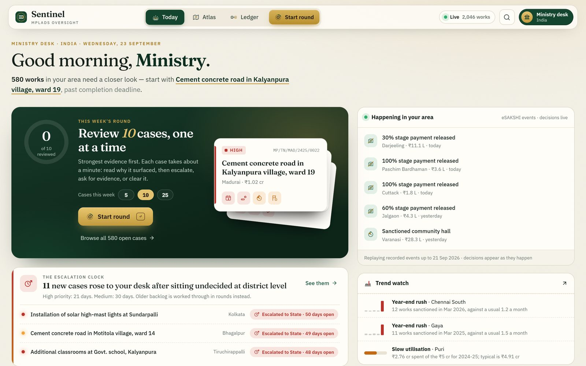
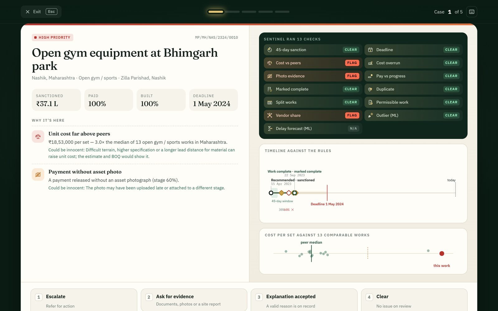
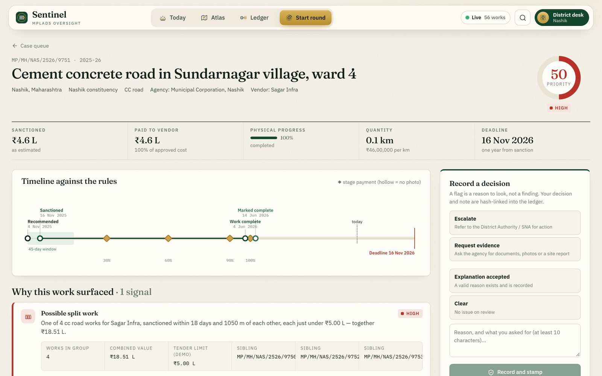
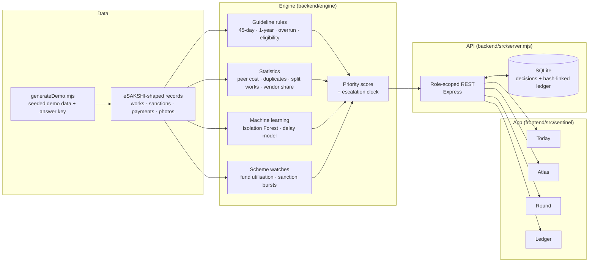
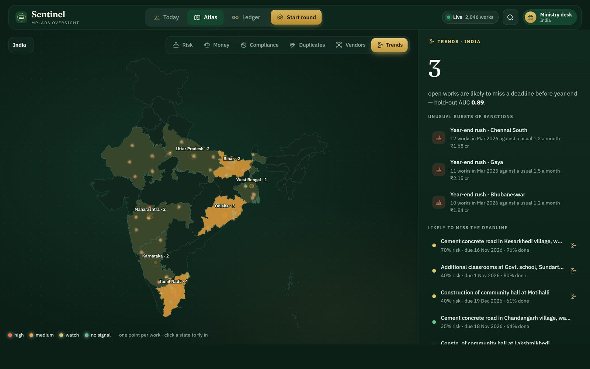

# MPLAD Sentinel

**An AI-powered system to find anomalies, fraud and inefficiencies in MPLADS works.**
Smart India Hackathon 2026 · Problem statement SIH26102 · MoSPI (DIID) · Theme: Smart Automation

Every year thousands of MPLADS works are recommended, sanctioned, paid for in stages and completed. No team can check them all by hand. Sentinel checks every work automatically and gives each official a short weekly list of the cases that need a decision. Each case comes with the evidence, the rule it rests on, and an innocent explanation to rule out.



---

## Contents

- [What's new in v2](#whats-new-in-v2)
- [Run it](#run-it)
- [How it works](#how-it-works)
- [Architecture](#architecture)
- [The checks](#the-checks)
- [How well it works](#how-well-it-works)
- [Project structure](#project-structure)
- [Versions and releases](#versions-and-releases)

---

## What's new in v2

v2 rebuilds the app around one idea: an official should never have to work out where to start.

| | v1 (original prototype) | v2 (this version) |
|---|---|---|
| Entry | Password login screen | Pick one of four desks in one click (Ministry, State, District, MP). Real deployment would use NIC Parichay sign-in |
| Main screen | Dashboard of charts and tables | **Today**: a greeting, the one case to open first, and this week's review round |
| Reviewing | Browse a list, open a record | **Round**: one case at a time, full screen. The 13 checks run on screen, then you escalate, ask for evidence or clear the case with keys 1–4 |
| Map | – | **Atlas**: a night map of India with one glowing point per work, and six lenses (Risk, Money, Compliance, Duplicates, Vendors, Trends) |
| Checks | Rule flags + Isolation Forest | **13 checks per work** plus 2 scheme-level watches (see below) |
| New checks | – | Cost overrun · works not permitted under the guidelines (English and Hindi) · split works just under the tender limit · fund utilisation · bursts of sanctions (e.g. year-end rush) |
| Automation | – | **Escalation clock**: a serious new case left undecided rises from the District desk to the State desk on its own |
| Honesty | Single risk score | Every check says *flag*, *clear* or *can't assess*. Missing data never counts as a pass |
| Testing | – | A demo dataset with a hidden answer key, so detection is measured, not claimed |
| Design | Standard components | Own icon set, illustrations, motion, and Fraunces + IBM Plex type (incl. Devanagari) |

---

## Run it

You need **Node.js 24 or newer** (the backend uses Node's built-in SQLite).

```bash
# terminal 1 — API on http://127.0.0.1:4000
cd backend
npm install
npm start
```

```bash
# terminal 2 — app on http://127.0.0.1:5173
cd frontend
npm install
npm run dev
```

Open http://127.0.0.1:5173 and choose a desk. For a demo, these links open a desk directly:

| Desk | Link | Good for showing |
|---|---|---|
| Ministry | `/?as=ministry` | Cases escalated from districts, trend alerts, the national map |
| State Nodal Authority | `/?as=state:Tamil%20Nadu` | Escalated cases, district comparison |
| District Authority | `/?as=district:Nashik&next=/desk/round` | Straight into a review round (split works, eligibility) |
| Member of Parliament | `/?as=mp:Nashik` | Read-only view of the constituency's works |

Other commands:

```bash
cd backend && npm test          # engine and API tests
cd backend && npm run generate  # rebuild the demo dataset (same seed, same result)
cd frontend && npm run lint     # lint
```

**Keyboard:** `Ctrl+K` search · `g t` / `g a` / `g l` / `g r` go to Today / Atlas / Ledger / Round · `1`–`4` choose a decision · `Ctrl+Enter` record it · `Esc` leave a round.

---

## How it works

1. **Read the record.** Each work's life on eSAKSHI: recommendation, sanction, stage payments with asset photos, progress, completion.
2. **Run the checks.** Guideline rules, comparison with similar works, duplicate and split-work detection, a text check against the list of works not permitted, and two machine-learning models.
3. **Explain, don't accuse.** A flag is a reason to look, not a finding. Each one shows its evidence and a plausible innocent explanation.
4. **Decide, or it rises.** Each desk works through a weekly round (5, 10 or 25 cases). A decision needs a short note and goes into a hash-linked ledger. A new serious case left undecided moves up a level on its own.

| Desk | Sees |
|---|---|
| Ministry (MoSPI) | All of India: where money is idle, late or at risk; cases escalated from states |
| State Nodal Authority | Its state: district comparison, escalated cases, 45-day and SC/ST compliance |
| District Authority | Its district: the weekly round of cases that need a decision |
| Member of Parliament | Its constituency, read-only: what is sanctioned, paid, stuck or complete |

The server enforces these limits. A district desk cannot ask for another district's data.

| Round | Case file |
|---|---|
|  |  |

---

## Architecture



- **Engine.** Runs once when the server starts and scores every work. Each check returns *flag*, *clear* or *can't assess*, with its evidence, an innocent explanation, a suggested next step and the date the problem began.
- **API.** Express. Each request carries the desk's token, and the server narrows the data to that desk's area. Decisions and the ledger live in SQLite. Each ledger entry stores the hash of the one before, so any edit breaks the chain, and `POST /api/ledger/verify` checks it.
- **App.** React 19 + Vite. Motion for transitions, NumberFlow for counting figures, an SVG map of India, and a custom icon set.
- **In deployment.** Replace the demo generator with an eSAKSHI data connector (read-only). Move SQLite to PostgreSQL, and sign officials in with NIC Parichay.

Main API routes: `/api/brief` (desk summary), `/api/cases` (filterable case list), `/api/cases/:id` (full case file), `POST /api/cases/:id/decision`, `/api/pulse` (live feed), `/api/compliance`, `/api/duplicates`, `/api/vendors`, `/api/trends`, `/api/ledger`, `/api/method`.



---

## The checks

**On every work (13)**

| Check | Type | Flags when |
|---|---|---|
| 45-day sanction | Rule | Sanctioned (or still pending) more than 45 days after recommendation |
| Deadline | Rule | Past the one-year completion date, with no extension on record |
| Cost vs peers | Statistics | Cost per unit is far above similar works in the same state (median/MAD, at least 8 peers) |
| Cost overrun | Rule | Revised estimate more than 20% above the sanction, or payments beyond the approved cost |
| Photo evidence | Rule | A stage payment was released without an asset photo |
| Pay vs progress | Rule | Paid percentage is more than 20 points ahead of physical progress |
| Marked complete | Rule | Fully paid more than 60 days ago but not marked complete |
| Duplicate | Statistics | Same type of work within 250 m with a matching description (phases excluded) |
| Split works | Statistics | 3 or more works of the same type, same vendor, within 45 days and 1.5 km, each just under the tender limit (₹5 L in the demo, set per state) |
| Permissible work | Rule | The description matches the guidelines' list of works not permitted: maintenance, government offices and quarters, inside places of worship, land acquisition, named assets, grants and loans, private bodies. Works in English and Hindi |
| Vendor share | Statistics | One vendor holds more than 30% of a constituency's sanctioned value |
| Outlier | ML | Isolation Forest finds an unusual mix of cost, timing and payment. Only raises priority, never flags alone |
| Delay forecast | ML | Logistic model predicts the work will miss its deadline |

**Across the scheme (2)**

| Watch | Flags when |
|---|---|
| Fund utilisation | A constituency spent less than 65% of what a typical constituency spent from its ₹5 cr for a closed year |
| Bursts of sanctions | Far more sanctions in one month than the constituency's usual rate (Poisson test, Bonferroni-corrected). Catches year-end rushes |

Plus SC 15% / ST 7.5% share per constituency and year.

---

## How well it works

The demo dataset has 2,046 works across 40 constituencies in 8 states, and a hidden answer key. It plants problems, and it also plants **legitimate look-alikes**: works that look suspicious but are fine. Examples are a big road with a fair unit rate, an approved extension, a Phase II road, a road *to* a temple, a small rate revision, and small works far apart. `npm test` measures:

| | Result |
|---|---|
| Planted problems found | 96–100% for every check (cost overrun, eligibility, split works, year-end rush: 100%) |
| Precision | Cost 97% · duplicates 100% · split works 100% · eligibility 100% · trend alerts 100% · vendor share 73% |
| False alarms on look-alikes | **0 of 173** |
| Delay model | AUC 0.89 on works sanctioned after the training period |

These numbers come from synthetic data, not field accuracy. The data is shaped like eSAKSHI records. Place names are real, but MPs, agencies and vendors are generic, so nothing here is a claim about a real person or body. The national figures on the landing page were read from the public eSAKSHI dashboard (18th Lok Sabha, 20 Sep 2026).

---

## Project structure

```
backend/
  engine/engine.mjs          all checks, models, scheme watches, evaluation
  lib/isolationForest.js     Isolation Forest (no external ML library)
  scripts/generateDemo.mjs   seeded demo data with answer key
  src/server.mjs             role-scoped API, decisions, ledger
  data/demo/works.json       generated demo data
  test/sentinel.test.mjs     detection quality, scoping, ledger, escalation
frontend/
  src/sentinel/              the v2 app
    pages/                   Entrance, Today, Atlas, Round, CaseFile, Cases, Ledger, Method
    icons.jsx                custom icon set
    atlasmap.jsx             India map (calibrated Mercator on @svg-maps/india)
    illustrations.jsx        landing illustration
    viz.jsx                  timeline, peer strip, money ribbon, charts
screenshots/                 images used in this README
```

**Legacy code.** The v1 code still sits in the repo so nothing is lost: `backend/src/index.mjs` and its `lib/` and `data/` files, and the old `frontend/src/pages`, `components`, `context` and `workspace` folders. The v2 app does not use it. Run the old API with `npm run legacy`. The cleanest copy of v1 is release **v1.0.0**.

---

## Versions and releases

| Version | What | Where |
|---|---|---|
| **v1.0.0** | Original prototype | [Release v1.0.0](https://github.com/vaidehi-snk/mplad-sentinel/releases/tag/v1.0.0) (tagged before v2 was merged) |
| **v2.0.0** | This redesign | `main` after this branch is merged. Publish it as release v2.0.0 |

To go back to v1 at any time: `git checkout v1.0.0`.
